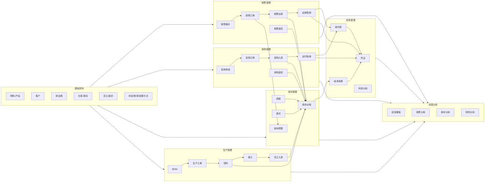
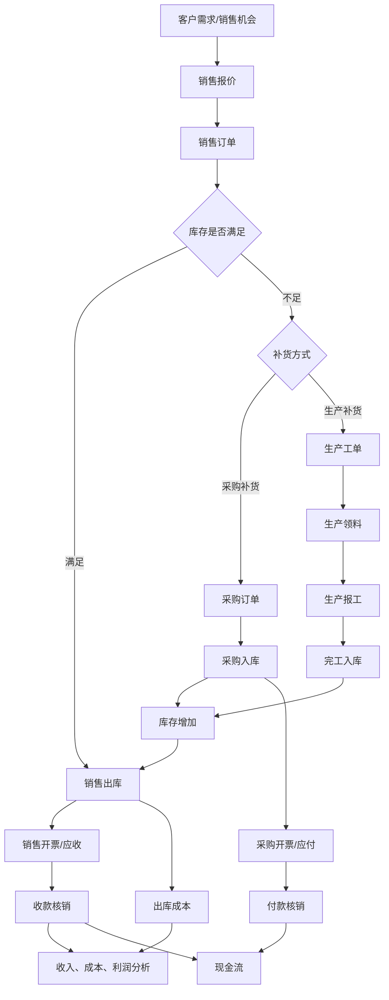
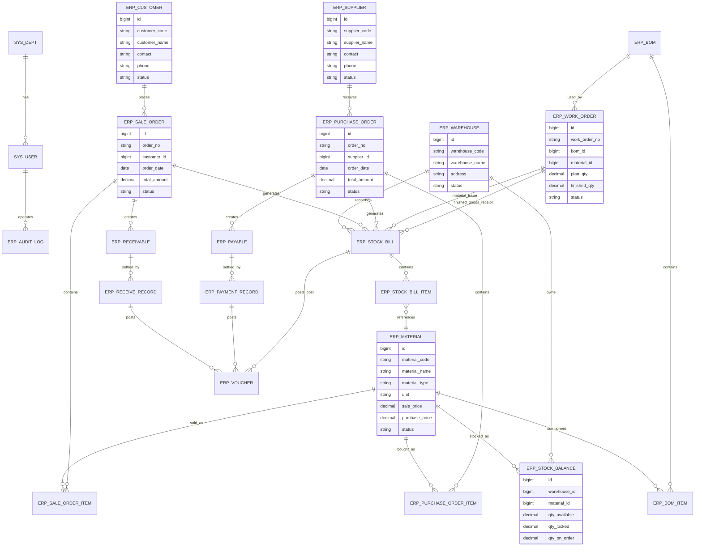

# ERP 业务模型图

本文档给出一套通用 ERP 业务模型，可用于后续模块拆分、数据库建模、菜单设计和接口规划。

## 1. ERP 总体业务模型



## 2. 核心业务闭环



## 3. 核心实体关系模型



## 4. 建议菜单结构

```text
ERP 管理
├─ 基础资料
│  ├─ 客户管理
│  ├─ 供应商管理
│  ├─ 物料管理
│  ├─ 仓库管理
│  └─ 计量单位/税率/结算方式
├─ 销售管理
│  ├─ 销售报价
│  ├─ 销售订单
│  ├─ 销售出库
│  ├─ 销售退货
│  └─ 应收账款
├─ 采购管理
│  ├─ 采购申请
│  ├─ 采购订单
│  ├─ 采购入库
│  ├─ 采购退货
│  └─ 应付账款
├─ 库存管理
│  ├─ 库存台账
│  ├─ 库存流水
│  ├─ 调拨单
│  ├─ 盘点单
│  └─ 库存预警
├─ 生产管理
│  ├─ BOM 管理
│  ├─ 生产工单
│  ├─ 生产领料
│  ├─ 生产报工
│  └─ 完工入库
├─ 财务管理
│  ├─ 收款单
│  ├─ 付款单
│  ├─ 凭证管理
│  └─ 成本核算
└─ 经营分析
   ├─ 销售看板
   ├─ 库存看板
   ├─ 采购分析
   └─ 利润分析
```

## 5. 单据状态建议

| 业务对象 | 状态流转 |
| --- | --- |
| 销售订单 | 草稿 -> 待审核 -> 已审核 -> 部分出库 -> 已出库 -> 已完成 -> 已关闭 |
| 采购订单 | 草稿 -> 待审核 -> 已审核 -> 部分入库 -> 已入库 -> 已完成 -> 已关闭 |
| 生产工单 | 草稿 -> 已下达 -> 生产中 -> 已完工 -> 已关闭 |
| 出入库单 | 草稿 -> 待审核 -> 已审核 -> 已过账 -> 已作废 |
| 应收/应付 | 未结算 -> 部分结算 -> 已结算 -> 已冲销 |

