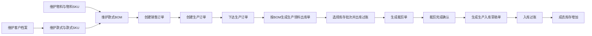
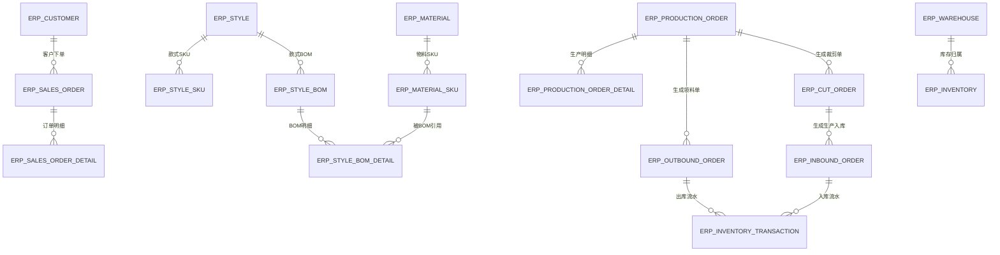

# 曹氏 ERP 当前业务模型说明

本文档根据当前项目代码、数据库脚本、前端页面和已实现工作流重新整理，用于描述系统已经落地的业务范围和功能链路。它不是通用 ERP 蓝图，也不包含当前项目尚未实现的供应商、采购订单、财务应收应付、调拨、盘点等模块。

## 1. 系统定位

ERP叫做 “一丫一ERP系统”,当前 ERP 面向童装/服装生产场景，核心目标是把“客户、款式、物料、BOM、销售订单、生产订单、领料出库、裁剪、生产入库、库存流水”串成一条可追踪的业务链。

系统已经具备的核心能力：

- 基础资料：客户档案、童装款式、款式 SKU、款式 BOM、物料档案、物料 SKU、仓库档案。
- 订单业务：销售订单、生产订单、发货单。
- 库存业务：入库单、出库单、库存汇总、库存流水。
- 生产业务：生产订单下达、按 BOM 生成领料出库单、领料出库过账、生成裁剪单、裁剪完成、生成生产入库单。
- 流程业务：基于 Flowable 的“生产领料裁剪流程”。
- 数据看板：订单、生产、出入库、库存、裁剪计划和低库存物料概览。
- AI 辅助：AI 对话、知识库、RAG 检索和 AI 对话日志，用于辅助查询系统资料，不属于 ERP 主业务闭环。

## 2. 模块边界

### 2.1 基础资料

基础资料是后续订单、生产、库存的主数据来源。

#### 客户档案

客户档案用于销售订单、生产订单、出入库单、发货单记录客户信息。当前系统维护客户基础信息，并在单据中冗余客户名称，方便查询和历史追踪。

#### 款式档案

款式档案是童装产品资料的核心。一个款式可以维护多个款式 SKU，SKU 按颜色、尺码形成具体销售和库存对象。

款式档案包含：

- 款式主信息：款号、款式名称、季节、品类、品牌、状态、样衣状态、生产状态等。
- 款式 SKU：颜色、尺码、SKU 编码、条码、吊牌价等。
- 款式 BOM：BOM 编号、版本、状态。
- BOM 明细：物料、物料 SKU、用量、损耗率、单位等。

生产领料依赖款式已维护并启用的 BOM。没有可用 BOM 的款式，不能按生产订单生成领料出库单。

#### 物料档案

物料档案用于维护面料、辅料、包装材料等生产用料。物料支持 SKU 明细，按颜色、规格、单位形成实际库存对象。

当前物料规则：

- 新增物料时，如果未填写物料编码，系统会按物料类型和分类生成编码。
- 物料 SKU 如果未填写 SKU 编码，系统会按物料编码、颜色、规格生成。
- 已被款式 BOM 引用的物料或物料 SKU 不允许直接删除。
- 修改物料或物料 SKU 后，会同步更新 BOM 明细中已引用的物料信息。

#### 仓库档案

仓库档案用于区分库存所在位置。当前页面支持物料仓、成衣仓、次品仓、样品仓等仓库类型。

生产领料默认优先选择仓库类型包含“物料”的仓库；裁剪完成生成生产入库单时，系统会查找仓库类型或仓库名称包含“成衣”的仓库。

## 3. 订单业务

### 3.1 销售订单

销售订单记录客户下单信息，明细选择款式 SKU，维护订购数量、单价和金额。

当前销售订单作为客户订单记录和生产订单来源。系统已实现销售订单的新增、修改、删除、查询、明细维护、Excel 导入、导入模板下载，以及从销售订单生成草稿生产订单。生成生产订单后，生产订单会保存销售订单 ID 和销售单号，销售订单状态会更新为“生产中”。系统仍未实现完整的销售审核、自动发货、应收账款等流程。

销售订单状态在前端可选：

- 草稿
- 已确认
- 生产中
- 已完成
- 已取消

### 3.2 发货单

发货单当前是独立的发货记录模块，维护客户、销售单号、仓库、发货日期和发货数量等信息。

当前发货单没有和库存出库过账强绑定，也没有自动扣减库存。实际库存扣减以出库单过账为准。

发货单状态在前端可选：

- 草稿
- 已发货
- 已取消

## 4. 生产业务

### 4.1 生产订单

生产订单是当前生产链路的起点。生产订单可关联销售订单和客户，明细选择款式 SKU，并维护计划生产数量、已裁剪数量、已缝制数量、已成品数量、合格数量等。

生产订单编号为空时，系统自动生成 `MO` 开头的单号。生产订单默认状态为“草稿”。

生产订单状态在前端可选：

- 草稿
- 已下达
- 裁剪中
- 缝制中
- 后整中
- 已完成
- 已关闭

当前已落地的生产订单动作：

- 新增、修改、删除生产订单。
- 草稿生产订单可以下达。
- 已下达且未关闭的生产订单可以按 BOM 生成生产领料出库单。
- 生产领料出库完成后，可以生成裁剪单。
- 未完成或未关闭的生产订单可以关闭。

### 4.2 按 BOM 生成领料出库单

生产订单下达后，系统可以根据生产订单明细中的款式 SKU 找到对应款式的已启用 BOM，并按计划数量、BOM 用量和损耗率计算物料需求。

计算规则：

- 物料需求量 = 计划生产数量 × BOM 单件用量 × (1 + 损耗率)。
- 件、颗、条、个等离散单位按整数向上取整。
- 其他单位按 3 位小数向上取整。
- 相同物料 SKU 和单位会合并成一条领料明细。

生成结果：

- 生成一张出库类型为“生产领料”的出库单。
- 来源类型为“生产订单”。
- 来源单号为生产订单号。
- 默认仓库优先选择物料仓。
- 出库单初始状态为“草稿”。
- 明细批次号初始为空，需要在出库单页面按库存批次选择后再过账。

限制规则：

- 草稿、已关闭、已完成、已完工的生产订单不能生成领料单。
- 如果生产订单已存在未取消的生产领料出库单，不能重复生成。
- 款式没有已启用 BOM，或 BOM 明细为空，不能生成领料单。

### 4.3 裁剪单

裁剪单用于记录生产订单进入裁剪环节后的计划和完成情况。

裁剪单可以由生产订单生成，生成前系统会校验该生产订单的生产领料出库单是否已经完成出库过账。

裁剪单状态：

- 0：待裁剪
- 1：裁剪中
- 2：已完成
- 3：已取消

当前已落地的裁剪动作：

- 新增、修改、删除裁剪单。
- 待裁剪或裁剪中的裁剪单可以延期。
- 待裁剪或裁剪中的裁剪单可以完成裁剪。
- 完成裁剪时填写实际裁剪数量。

裁剪完成后的系统行为：

- 更新裁剪单状态为已完成。
- 按裁剪明细分配实际裁剪数量。
- 生成一张入库类型为“生产入库”的入库单。
- 入库单来源类型为“裁剪单”，来源单号为裁剪单号。
- 入库明细的库存对象类型为“成衣”。
- 入库批次号使用裁剪单号。
- 入库单生成后仍为草稿，库存增加需要再执行入库单过账。

## 5. 库存业务

### 5.1 库存对象

当前库存支持两类对象：

- 物料：对应物料 SKU。
- 成衣：对应款式 SKU。

库存按仓库、库存对象类型、库存对象 ID、批次等维度汇总。库存汇总展示可用库存、锁定库存、单位、单价等信息。

### 5.2 入库单

入库单用于增加库存。入库单编号为空时自动生成 `RK` 开头单号，默认状态为“草稿”。

前端支持的入库类型：

- 采购入库
- 生产入库
- 销售退货
- 盘盈入库
- 其他入库

注意：这些入库类型目前是单据分类字段，不代表系统已经实现了完整的采购、销售退货或盘点业务模块。

入库过账规则：

- 入库明细不能为空。
- 入库数量必须大于 0。
- 入库过账后增加库存可用数量。
- 入库过账后写入库存流水，流水入库数量为本次入库数量。
- 入库单状态更新为“已入库”。

取消入库过账规则：

- 只有“已入库”的入库单允许取消过账。
- 取消过账会按原入库数量扣回库存。
- 如果库存已被后续业务占用导致可用数量不足，取消过账会失败。
- 取消过账会写入一条反向库存流水。

### 5.3 出库单

出库单用于扣减库存。出库单编号为空时自动生成 `CK` 开头单号，默认状态为“草稿”。

前端支持的出库类型包括生产领料、销售出库、采购退货、盘亏出库、其他出库等。当前生产领料已经和生产订单、BOM、工作流打通；其他类型主要作为通用出库分类字段使用。

出库过账规则：

- 出库明细不能为空。
- 出库数量必须大于 0。
- 出库时按仓库、库存对象、批次查询库存。
- 可用库存不足时禁止过账。
- 过账后扣减库存可用数量。
- 过账后写入库存流水，流水出库数量为本次出库数量。
- 出库单状态更新为“已出库”。

取消出库过账规则：

- 只有“已出库”的出库单允许取消过账。
- 已完成的出库单不能取消过账。
- 取消过账会把原出库数量加回库存。
- 取消过账会写入一条反向库存流水。

### 5.4 库存流水

库存流水记录每次入库、出库、取消入库、取消出库产生的库存变化。

流水字段包含：

- 流水号
- 业务类型
- 业务单号
- 仓库
- 库存对象类型
- 库存对象编码和名称
- 批次号
- 入库数量
- 出库数量
- 结存数量
- 操作人
- 发生时间

库存流水是追踪库存变化的主要依据。

## 6. 生产领料裁剪工作流

当前项目通过 Flowable 实现了一个生产流程：`production_cut_flow`，名称为“生产领料裁剪流程”。

流程节点：

1. 发起生产流程。
2. 下达生产单。
3. 生成领料单。
4. 领料出库过账。
5. 生成裁剪单。
6. 裁剪完成确认。
7. 流程完成。

流程发起条件：

- 用户在生产工作流页面选择一张生产订单。
- 流程任务默认由当前发起用户处理，当前页面不提供指定领料处理人或裁剪处理人的入口。
- 同一个生产订单不能同时存在运行中的生产流程实例。

流程自动动作：

- 流程启动后自动下达生产订单。
- 自动按 BOM 生成生产领料出库单。
- 领料出库任务完成后自动生成裁剪单。

人工任务：

- 领料出库过账：处理人需要在出库单中选择批次并完成过账。
- 裁剪完成确认：处理人填写实际裁剪数量并完成裁剪。

流程和库存的关系：

- 领料出库过账会扣减物料库存并产生库存流水。
- 裁剪完成只生成生产入库草稿单。
- 成衣库存增加需要对生产入库单再次执行入库过账。

## 7. 当前业务主链路

## 8. 核心数据关系

## 9. 页面菜单结构

当前前端已经实现的 ERP 页面主要包括：

- 首页看板：订单、生产、出入库、库存、裁剪计划和物料低库存概览。
- 基础资料：客户档案、款式档案、物料档案、仓库档案。
- 订单管理：销售订单、发货单。
- 库存管理：库存汇总、库存流水、入库单、出库单。
- 生产管理：生产订单、裁剪单。
- 工作流：生产领料裁剪流程。
- AI 工具：AI 对话、知识库。

## 10. AI 辅助模块

AI 模块已经独立为 `ruoyi-ai` 子模块，主要提供智能问答、知识库和对话日志能力。

当前 AI 能力：

- AI 对话页面支持选择模型。
- 后端通过 Ollama 调用本地模型，例如 `qwen3:8b`。
- 支持知识库分段、向量化和 RAG 检索。
- AI 对话日志记录输入、输出、模型名称、成功/失败状态、失败原因和操作账号。
- AI 对话页面在菜单切换时保留当前会话，只有手动关闭对话页签时才清除页面会话。

AI 模块适合回答系统资料、操作说明、业务规则等问题，但不直接修改 ERP 单据，也不替代出入库过账、生产流程审批等业务动作。

## 11. 当前未实现或未完整闭环的功能

为避免知识库误导用户，以下功能不应描述为当前 ERP 已经完整实现：

- 供应商档案独立模块。
- 采购申请、采购订单、采购到货、供应商对账等完整采购流程。
- 应收账款、应付账款、收付款、费用、凭证、总账等财务模块。
- 库存调拨单。
- 库存盘点单和盘盈盘亏完整流程。
- 独立库存预警处理流程。当前看板可展示低于安全库存的物料，但没有完整预警单据闭环。
- 销售报价、销售退货完整流程。
- 采购退货完整流程。
- 成本核算、生产报工、缝制/后整工序流转。
- 发货单自动扣减库存。

如果后续新增这些模块，应同步更新本文档，并补充相应的表结构、页面、接口、状态流和业务约束。

## 12. 面向 RAG 的问答边界

当用户询问当前 ERP 能力时，应优先依据本项目真实功能回答：

- 可以回答：客户、款式、物料、BOM、销售订单、生产订单、领料出库、裁剪、生产入库、库存汇总、库存流水、生产工作流、AI 对话日志等。
- 需要谨慎回答：采购入库、销售出库、销售退货、盘盈入库、盘亏出库、采购退货等字段级分类。它们目前更多是出入库单类型，不代表完整业务模块已经实现。
- 应明确说明未实现：供应商、采购订单、财务应收应付、调拨、盘点、成本核算等完整模块。

对用户问题的推荐回答方式：

- 先说明当前系统已实现的功能。
- 再说明该功能在系统中的入口、关联单据和库存影响。
- 如果用户问到未实现功能，应明确说“当前系统没有独立实现该模块”，并可说明现有字段或通用单据能覆盖到什么程度。
